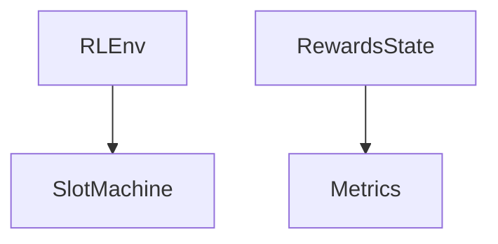

# Core 模块

Core 模块包含多臂老虎机项目的核心类和数据模型。

## 公开接口

### environment.py
- `SlotMachine`: 老虎机类，每次拉动有一定概率获得奖励
- `RLEnv`: 强化学习环境类，包含多个老虎机

### schemas.py
- `RewardsState`: 奖励状态模型，记录每个老虎机的累积奖励、拉动次数、Q值等
- `Metrics`: 评估指标模型，包含后悔值、后悔率、最佳臂命中率等指标
- `UCBInitState`: UCB算法初始化状态模型

## 业务逻辑

Core 模块提供了多臂老虎机问题的基础结构：
1. `SlotMachine` 类模拟单个老虎机，具有特定的奖励概率
2. `RLEnv` 类管理多个老虎机的环境，提供拉动老虎机和计算最佳奖励的方法
3. `RewardsState` 模型用于跟踪代理在每个老虎机上的表现
4. `Metrics` 模型用于评估代理的性能

## 数据流



## 用法示例

```python
from bandit.core.environment import RLEnv
from bandit.core.schemas import RewardsState

# 创建包含10个老虎机的环境
env = RLEnv(machine_count=10, seed=42)

# 从环境初始化奖励状态
rewards = RewardsState.from_env(env)