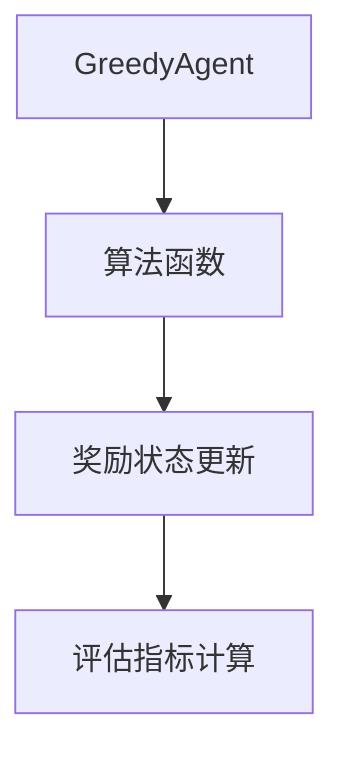

# Greedy 模块

Greedy 模块实现了各种贪婪算法及其代理。

## 公开接口

### config.py
- `EpsilonDecreasingState`: ε-递减状态配置
- `EpsilonDecreasingConfig`: ε-递减参数配置

### agent.py
- `GreedyAgent`: 贪婪算法代理类

### algorithms.py
- `greedy_normal`: 普通贪婪算法（基于累计奖励）
- `epsilon_greedy`: ε-贪婪算法（基于累计奖励）
- `epsilon_decreasing_greedy`: ε-递减贪婪算法（基于累计奖励）
- `greedy_average`: 普通贪婪算法（基于平均奖励）
- `epsilon_average`: ε-贪婪算法（基于平均奖励）
- `epsilon_decreasing_average`: ε-递减贪婪算法（基于平均奖励）

## 业务逻辑

Greedy 模块提供了多种贪婪算法实现：
1. 普通贪婪算法：总是选择当前看来最好的老虎机
2. ε-贪婪算法：以一定概率随机探索，否则利用已知信息
3. ε-递减贪婪算法：随着训练进行逐渐减少探索概率

这些算法可以与 `GreedyAgent` 结合使用来解决多臂老虎机问题。

## 数据流



## 用法示例

```python
from bandit.greedy.agent import GreedyAgent
from bandit.greedy.algorithms import epsilon_greedy
from bandit.greedy.config import EpsilonDecreasingConfig
from bandit.core.environment import RLEnv

# 创建环境
env = RLEnv(machine_count=10, seed=42)

# 创建代理
agent = GreedyAgent(
    name="epsilon_greedy_agent",
    env=env,
    greedy_algorithm=epsilon_greedy,
    epsilon_config=EpsilonDecreasingConfig(start_epsilon=0.1)
)

# 执行行动
action = agent.act(epsilon=0.1)
reward = agent.pull_machine(action)