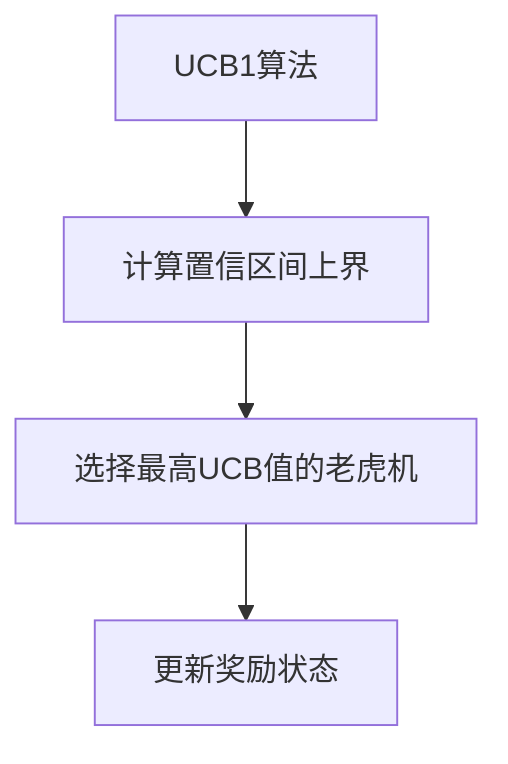

# UCB1 模块

UCB1 模块实现了基于置信区间上界的算法。

## 公开接口

### algorithms.py
- `ucb1`: UCB1算法实现

## 业务逻辑

UCB1（Upper Confidence Bound 1）算法是一种经典的多臂老虎机解决方法，它基于以下思想：
1. 选择老虎机时不仅要考虑当前的平均奖励（利用）
2. 还要考虑不确定性（探索）
3. 通过置信区间的上界来平衡探索与利用

UCB1算法的公式为：`UCB1(i) = Q(i) + sqrt(2 * ln(t) / N(i))`
其中：
- `Q(i)` 是老虎机i的平均奖励
- `t` 是当前的总步数
- `N(i)` 是老虎机i被拉动的次数

## 数据流



## 用法示例

```python
from bandit.ucb1.algorithms import ucb1
from bandit.core.schemas import RewardsState
import random

# 初始化奖励状态
rewards = RewardsState.from_env(env)

# 使用UCB1算法选择行动
action = ucb1(rewards, random.Random(42), steps=100)